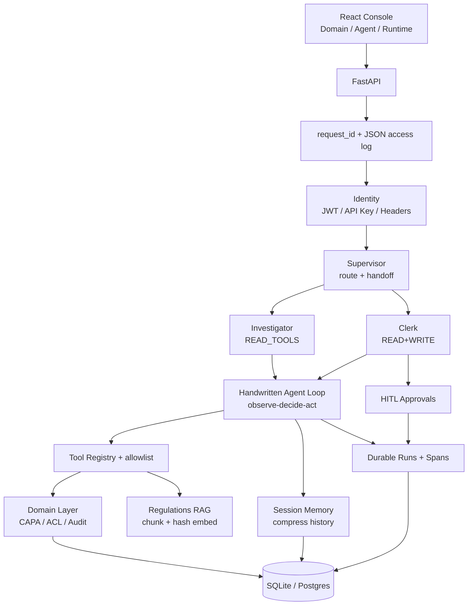

# Agent Runtime 架构（一页纸）

```mermaid
flowchart TB
  UI[React Console<br/>Domain / Agent / Runtime]
  API[FastAPI]
  Auth[Identity<br/>JWT / API Key / Headers]
  Obs[request_id + JSON access log]
  Super[Supervisor<br/>route + handoff]
  Inv[Investigator<br/>READ_TOOLS]
  Clerk[Clerk<br/>READ+WRITE]
  Loop[Handwritten Agent Loop<br/>observe-decide-act]
  Tools[Tool Registry + allowlist]
  Domain[Domain Layer<br/>CAPA / ACL / Audit]
  RAG[Regulations RAG<br/>chunk + hash embed]
  Mem[Session Memory<br/>compress history]
  DB[(SQLite / Postgres)]
  HITL[HITL Approvals]
  Runs[Durable Runs + Spans]

  UI --> API
  API --> Obs --> Auth
  Auth --> Super
  Super --> Inv
  Super --> Clerk
  Inv --> Loop
  Clerk --> Loop
  Loop --> Tools
  Tools --> Domain
  Tools --> RAG
  Loop --> Mem
  Domain --> DB
  Mem --> DB
  Loop --> Runs
  Clerk --> HITL
  HITL --> Runs
  Runs --> DB
```

## 不变式

1. 写路径必须经领域层（状态机 + 审计）  
2. Investigator 无写工具；Clerk 写工具可 HITL  
3. `LLM_PROVIDER=mock` 全链路可演示；真 LLM 可选  
